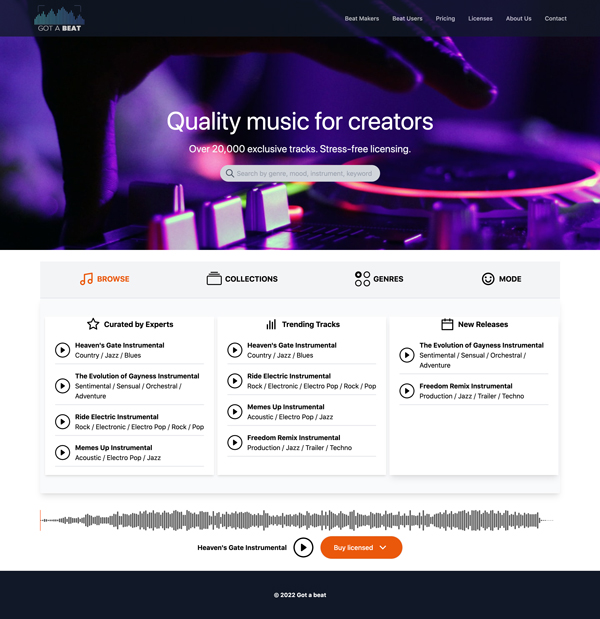

# Got A Beat Demo App

Music producers with approved accounts can upload instrumentals (WAV or AIFF files) which are easy to listen to, scroll through, and search by bpm, or by mood, or by most-or-least-often used.

Each beat shows a waveform that lets you click to different points in the instrumental, and have a “License” button next to it, which takes you to a page giving you three options of license types “Single Use”, “Non-Exclusive License” and “Exclusive License”.

[Next JS][TailwindCSS]

[Live Demo](https://gotabeat.vercel.app/)



## Getting Started

First, run the development server:

```bash
npm run dev
# or
yarn dev
```

## Getting Started

To get a local copy up and running follow these simple example steps.

### Prerequisites

Make sure Node.js is running on your local machine

### Setup

~~~bash
$ git clone git@github.com:acushlakoncept/gotabeat.git
$ cd gotabeat
~~~

Install modules:

```
npm install
```

Setup your API Key for Auth0

- Follow the steps [here](https://auth0.com/docs/quickstart/webapp/nextjs/01-login) to setup your app
- Locate the file `.env.local.example` in your root directory, remove the .example leaving you with `.env.local`
- You can find the corresponding fields from your Auth0 dashboard

### Usage

Start server with:

```
  npm run dev
```

# Authors

👤 **Uduak Essien**

- Github: [@acushlakoncept](https://github.com/acushlakoncept/)
- Twitter: [@acushlakoncept](https://twitter.com/acushlakoncept)
- Linkedin: [acushlakoncept](https://www.linkedin.com/in/acushlakoncept/)

## 🤝 Contributing

Contributions, issues and feature requests are welcome!

Feel free to check the [issues page](issues/).

## Show your support

Give a ⭐️ if you like this project!

## Acknowledgments
- Project inspired by [EVENT RAP](https://www.eventrap.com/)


